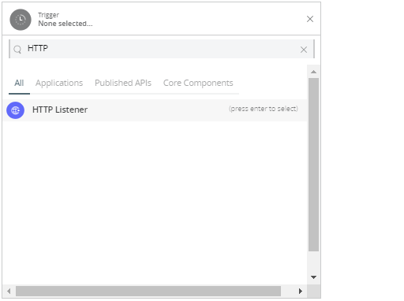
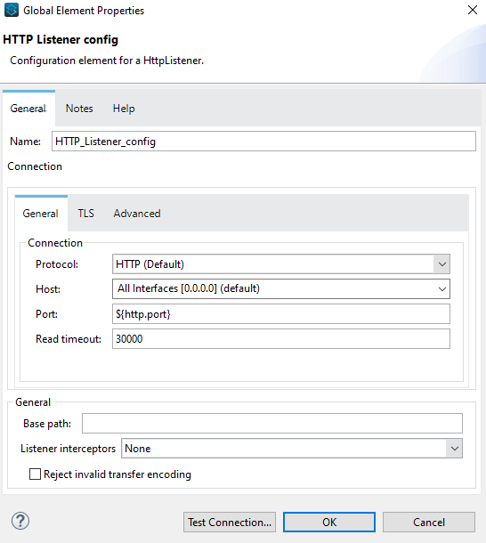

= ClickUp Connector

== ⦁    DOCUMENT REVISION HISTORY

[%header%autowidth.spread]
|===
|Version  |Release Date |Revised by |Comments/ Indicate Sections Revised
|1.0.0 |2023-05 |Connector Development Team |
|===

== ⦁    INTRODUCTION
⦁   *Purpose*

This specification document outlines the instructions for using ClickUp Connector operations.

⦁   *Overview*

ClickUp is an all-in-one productivity and project management tool built for teams of all types across any industry to scale up business.In this platform we can plan, track, and collaborate on any project, build the perfect workflow for individual and team, create marketing campaigns, manage development sprints, and more.Hierarchy is followed as workspaces, folders, lists, task and subtasks

*A high-level diagram of the architecture is shown below*

== ⦁	LIST OF OPERATIONS SUPPORTED BY THE CLICKUP CONNECTOR:
== Attachments

[%header%autowidth.spread]
|===
|Sr.No |Business Function |Operations |Description |Inbound |Outbound
|1 |Create Task Attachment |POST Request |Upload a file to a task as an attachment. | Upload a file as form-data with key '*attachment*' |Returns JSON Response
|===
== Comments
[%header%autowidth.spread]
|===
|Sr.No |Business Function |Operations |Description |Inbound |Outbound
|1 |Get Task Comments |GET Request |View task comments. | Required fields are NIL |Returns JSON Response
|2 |Create Task Comment |POST Request |Add a new comment to a task. | Required fields are *comment_text,assignee,notify_all* |Returns JSON Response
|3 |Get Chat View Comments |GET Request |View comments from a Chat view. | Required fields are NIL |Returns JSON Response
|4 |Create Chat View Comment |POST Request |Add a new comment to a Chat view. | Required fields are *comment_text,notify_all* |Returns JSON Response
|5 |Get List Comments |GET Request |View the comments added to a List. | Required fields are NIL |Returns JSON Response
|6 |Create List Comment |POST Request |Add a comment to a List. |  Required fields are *comment_text,assignee,notify_all* | Returns JSON Response
|7 |Update Comment |PUT Request |Replace the content of a task commment, assign a comment, and mark a comment as resolved. | Required fields are *comment_text,assignee,resolved* |Returns JSON Response
|8 |Delete Comment |POST Request |Delete a task comment. | Required fields are NIL |Returns blank JSON object
|===
== Custom Fields
[%header%autowidth.spread]
|===
|Sr.No |Business Function |Operations |Description |Inbound |Outbound
|1 |Get Accessible Custom Fields |GET Request |View the Custom Fields available on tasks in a specific List. | Required fields are NIL |Returns JSON Response
|2 |Set Custom Field Value |POST Request |Add data to a Custom field on a task. | Required fields are *value* |Returns JSON Response
|3 |Remove Custom Field Value |DELETE Request |Remove the data from a Custom Field on a task. This does not delete the option from the Custom Field. | Required fields are NIL |Returns blank JSON object
|===
== Lists
[%header%autowidth.spread]
|===
|Sr.No |Business Function |Operations |Description |Inbound |Outbound
|1 |Get Lists |GET Request |View the Lists within a Folder. | Required fields are NIL |Returns JSON Response
|2 |Create List |POST Request |Add a new List to a Folder. | Required fields are *name,content,due_date,due_date_time,priority,assignee,status* |Returns JSON Response
|3 |Get Folderless Lists |GET Request |View the Lists in a Space that aren't located in a Folder. | Required fields are NIL|Returns JSON Response
|4 |Create Folderless List |POST Request |Add a new List in a Space. | Required fields are *name,content,due_date,due_date_time,priority,assignee,status* |Returns JSON Response
|5 |Get List |GET Request |View information about a List. | Required fields are NIL |Returns JSON Response
|6 |Update List |PUT Request |Rename a List, update the List Info description, set a due date/time, set the List's priority, set an assignee, set or remove the List color. | Required fields are *name,content,due_date,due_date_time,priority,assignee,status,unset_status* |Returns JSON Response
|7 |Delete List |DELETE Request |Delete a List from your Workspace. | Required fields are NIL |Returns blank JSON object
|8 |Add Task To List |POST Request |Add a task to an additional List. | Required fields are NIL |Returns JSON Response
|9 |Remove Task From List |DELETE Request |Remove a task from an additional List. You can't remove a task from its home List. | Required fields are NIL |Returns blank JSON object
|===
== Tasks
[%header%autowidth.spread]
|===
|Sr.No |Business Function |Operations |Description |Inbound |Outbound
|1 |Get Tasks |GET Request |View the tasks in a List. | Required fields are NIL |Returns JSON Response
|2 |Create Task |POST Request |Create a new task. | Required fields are *name,description,assignees,tags,status,priority,due_date,due_date_time,time_estimate,start_date,start_date_time,notify_all,parent,links_to,check_required_custom_fields,custom_fields[].id, custom_fields[].value* |Returns JSON Response
|3 |Get Task |GET Request |View information about a task. | Required fields are NIL |Returns JSON Response
|4 |Update Task |PUT Request |Update a task. | Required fields are *name,description,assignees[].add,assignees[].rem,status,priority,due_date,due_date_time,time_estimate,start_date,start_date_time,parent,archived* |Returns JSON Response
|5 |Delete Task |DELETE Request |Delete a task from your Workspace. | Required fields are NIL |Returns blank JSON object
|6 |Get Filtered Team Tasks |GET Request |View the tasks that meet specific criteria from a Workspace. | Required fields are NIL |Returns JSON Response
|7 |Get Task's Time in Status |GET Request |View how long a task has been in each status. | Required fields are NIL |Returns JSON Response
|8 |Get Bulk Tasks' Time in Status |GET Request |View how long two or more tasks have been in each status. | Required fields are NIL |Returns JSON Response
|===
== Users
[%header%autowidth.spread]
|===
|Sr.No |Business Function |Operations |Description |Inbound |Outbound
|1 |Invite User To Workspace |POST Request |Invite someone to join your Workspace as a member. To invite someone as a guest, use the Invite Guest endpoint. | Required fields are *email,admin,custom_role_id* |Returns JSON Response
|2 |Get User |GET Request |View information about a user in a Workspace. | Required fields are NIL |Returns JSON Response
|3 |Edit User On Workspace |PUT Request |Update a user's name and role. | Required fields are *username,admin,custom_role_id* |Returns JSON Response
|4 |Remove User From Workspace |DELETE Request |Deactivate a user from a Workspace. | Required fields are NIL |Returns JSON Response
|===
== Teams - Workspaces
[%header%autowidth.spread]
|===
|Sr.No |Business Function |Operations |Description |Inbound |Outbound
|1 |Get Authorized Teams (Workspaces) |GET Request |View the Workspaces available to the authenticated user. | Required fields are NIL |Returns JSON Response
|===

==  ⦁   CONFIGURATION FOR ClickUp CONNECTOR
To use Clickup Connector, you will require the following configuration properties.

    Base Uri: Base URL of Clickup platform.    

    Access Token: Valid and Active access token generated explicitly by user

    Connection timeout: Timeout for connection, in Seconds(Default).

==  ⦁   TO CONNECT IN DESIGN CENTER

⦁ In Design Centre, click Create and choose Mule Application.

⦁ Click a trigger such as an HTTP Listener or the Scheduler trigger.

⦁ To create an HTTP global element for the connector, set these fields:

[%header%autowidth.spread]
|===
|Field |Description
|Protocol |Protocol selected for the HTTP connector, it can be HTTP or HTTPS (secure).
|Host |IP address where your Mule application listens for requests.
|Port |Port address where your Mule application listens for requests.
|Base Path |Path where your Mule application listens for requests.
|===

⦁	Select the plus sign to add a component.

⦁	Select the Clickup Connector as a component.

⦁	Select an operation:

image::img/Clickup_connctor_design_center.png[]

⦁	Configure the Global element for the connector:

⦁	Fill the required parameters (if any) for the above selected operation.

==  ⦁   Running in Anypoint Studio :

⦁ Drag and drop an HTTP Listener in the canvas.

⦁ In the Listener properties, give a path you want to use to trigger the listener.

⦁ Add a new Configuration as follows,

⦁ Test the connection and click on Okay.

⦁ Make sure your mule palette has Clickup module. If you do not have Clickup module in your palette, go to search in exchange -> search for Clickup and click on Add.

⦁ Now add configurations for Clickup.

⦁ Go to global-configurations.xml global elements -> create -> Connector Configuration -> Clickup Config

⦁ Add following properties.

    Base Uri : (Default)    
    Access Token :

image::img/global_config.png[]

image::img/global_config_advanced.png[]

⦁	Use the connector with requireed operation

⦁   *To Install Clickup Connector in Anypoint Studio*

link:user-manual.adoc[]

⦁	*About Connector Namespace and Schema*

When designing your application in Studio, drag and drop the connector in your canvas and the Namespace and schema get populated in the config file as below,

*Namespace:*   http://www.mulesoft.org/schema/mule/clickup

*Schema Location:*  http://www.mulesoft.org/schema/mule/clickup/current/mule-clickup.xsd