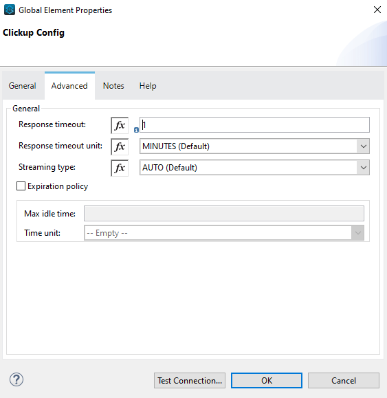

= ClickUp Connector

MuleSoft Certified

== About ClickUp

ClickUp is an all-in-one productivity and project management tool built for teams of all types across any industry to scale up business.In this platform we can plan, track, and collaborate on any project, build the perfect workflow for individual and team, create marketing campaigns, manage development sprints, and more.Hierarchy is followed as workspaces, folders, lists, task and subtasks

== About ClickUp Connector

We can perform multiple operations in a workspace via available ClickUp APIs. Anypoint Connector for ClickUp provides the same capability to perform multiple operations related to ClickUp platform in understandable JSON format.

== Prerequisites
This document assumes that you are familiar with Mule, Anypoint Connectors,
Anypoint Studio Essentials, Mule flows, and Mule Global Elements.

To use ClickUp connector, you need

* Anypoint Studio version 7.

== Mule Compatibility

[width="100%", options="header"]
|=======
|Application/Service |Version
|Mule Runtime |4.3.x and later
|Anypoint Studio | 7.4.x and later
|=======

== What's New in this Connector

* This ClickUp connector 1.0.0 is compatible with Mule 4.

== To Install this Connector in Anypoint Studio 7
You can use ClickUp Connector in Anypoint Studio by adding it as a dependency in your Mule application.

. Open your Mule project in Anypoint Studio.
. Add the connector as a dependency in the pom.xml file:

```
<dependency>
    <groupId>com.mulesoft.connectors</groupId>
    <artifactId>clickup</artifactId>
    <version>1.0.0</version>
    <classifier>mule-plugin</classifier>
</dependency>
```

When Studio has an update, a message displays in the lower right corner, which
you can click to install the update. After updating, update Maven pom.xml file dependencies to the new version.

== Configure in Studio

=== To Configure the Connector
* After adding connector dependency to Mule project, click on *Global Elements* tab at the base of the canvas.
* In the Global Mule Configuration Elements screen, click *Create*.
* In the Choose Global Type wizard, collapse connector configuration and select *'ClickUp Config'* and click OK.


* The configuration parameters to configure is

+
[options="header",width="50%"]
|============
|Field Name         |Value
|Base Uri           |Base URL of ClickUp platform.
|Access Token       |Valid and Active access token generated explicitly by user
|Response Timeout   |Timeout for response, in Minutes(Default).

|============
+

* Parameter values can be directly entered into the global configuration properties, or reference from a configuration file that contains these values.
Here we are adding values to application properties file and reference it using placeholders.




* Make a *Test Connection...* to check that the configuration is correct.

image::img/test_connect_success.png[]

* On success, configuration is ready to use!

* ClickUp_Config configuration should look like below in Configuration XML:
+
```xml
   <clickup:config name="Clickup_Config" doc:name="Clickup Config" doc:id="7c3044b4-b63d-445c-affe-f613a0f954a3" >
		<clickup:oauth-connection baseUri="${clickup.baseUri}" access_token="${clickup.access_token}" />
	</clickup:config>
```


== ​To Create a Mule Project in Anypoint Studio 7

The ClickUp connector is an operation-based connector, which means that when you add the connector to your flow, you need to configure a specific operation the connector is intended to perform. Below is the *"Get Lists"* operation for better understanding.

* Create new Mule Application in Studio and configure *HTTP Listener* to port 8081.

image::img/HTTP_Listener_Config.png[]

* Add "/getlists" path to test the flow.


* Select *'Get Lists'* operation from ClickUp module, drag & drop it into canvas. Click on the operation.


* Select ClickUp configuration from drop down which was already configured previously in global elements, or if required new configuration can be added by clicking green plus (+) symbol.


* Make sure to test your connection, if you have added new connection details.
* Enter required details for *Retrieve the current user context's user information* operation and save.

image::img/get_lists_operation_with_details.png[]

* Save the Mule project.
* Complete flow looks as below.


* Run the project as a Mule Application by right-clicking the project name in the Package Explorer, selecting Run As > Mule Application.
* Open Postman and check the response after entering the URL *http://localhost:8081/getlists*. You should see the 200 OK.This mean request has been sent successfully

```xml
<?xml version="1.0" encoding="UTF-8"?>

<mule xmlns:http="http://www.mulesoft.org/schema/mule/http" xmlns:clickup="http://www.mulesoft.org/schema/mule/clickup"
	xmlns="http://www.mulesoft.org/schema/mule/core"
	xmlns:doc="http://www.mulesoft.org/schema/mule/documentation" xmlns:xsi="http://www.w3.org/2001/XMLSchema-instance" xsi:schemaLocation="http://www.mulesoft.org/schema/mule/core http://www.mulesoft.org/schema/mule/core/current/mule.xsd
http://www.mulesoft.org/schema/mule/clickup http://www.mulesoft.org/schema/mule/clickup/current/mule-clickup.xsd
http://www.mulesoft.org/schema/mule/http http://www.mulesoft.org/schema/mule/http/current/mule-http.xsd">
	<flow name="get-lists-flow" doc:id="23f99881-c982-40c9-acd0-a3702042aea9" >
		<http:listener doc:name="GET /getlists" doc:id="202265bf-feba-49dd-9b07-5982e3943cd0" config-ref="HTTP_Listener_config" path="/getlists"/>
		<clickup:get-lists doc:name="Get Lists" doc:id="2697519d-1314-46c2-b05c-60f0b37d7f32" config-ref="Clickup_Config" folderId="#[attributes.queryParams.folderid]"/>
	</flow>
</mule>

```

== See Also

link:release-notes.adoc[]


